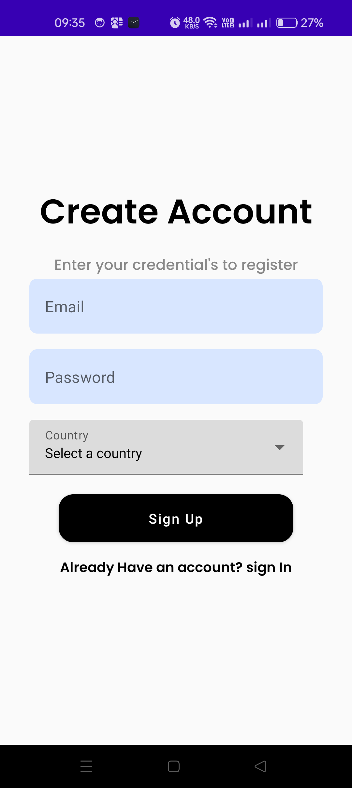
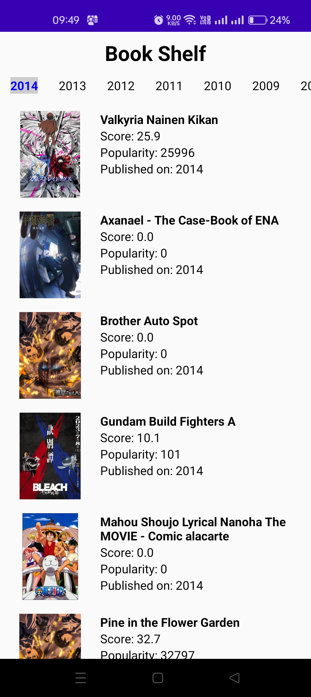
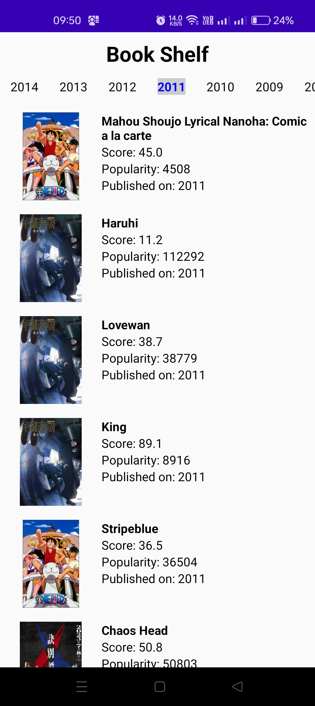

BookShelf

MVVM architecture
Single activity and uses compose navigation
Retrofit for Network calls
Made network call cache using retrofit & database
Dependency injection is used.(HILT)
Handled EdgeCases
Valid username and password
Invalid user login
Create user failure
Filter books based on published timestamp

The apk is attached in the project "app-debug.apk".
This app contains-

1. Login Screen

2.Sign Up Screen

3.Book Shelf Screen

